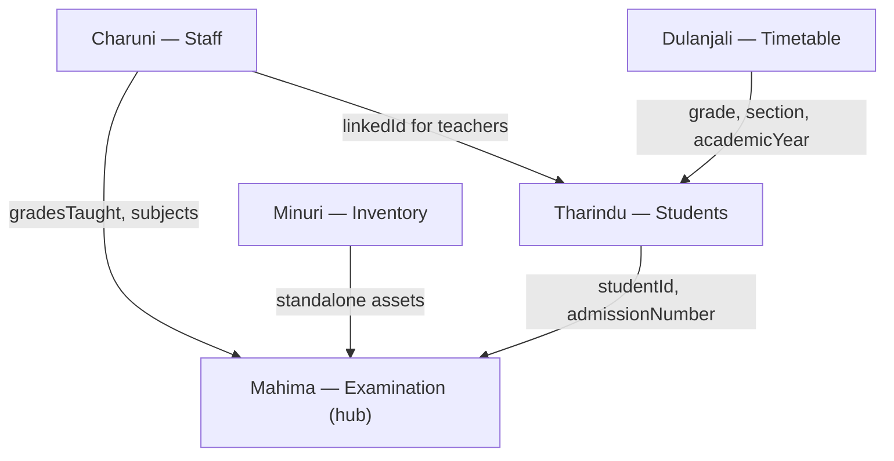

# Module Integration Guide

Mahima (Examination) is the **main developer** and integration hub. All other modules must integrate with the Examination layer without breaking shared types, Firestore collections, or access control.

## Shared contracts (owned by Mahima)

| Asset | Path in Mahima's `2026-06-30/` | Purpose |
|-------|----------------------------------|---------|
| Core types | `types/index.ts` | `Student`, `Staff`, `Examination`, `ExamResult`, `InventoryItem`, `ClassTimetable` |
| Access control | `lib/access-control.ts` | Role helpers (`canManageExams`, `canViewStudentRecord`, etc.) |
| Firestore shared | `lib/firestore/shared.ts` | `sanitizeFirestoreWrite`, `toExam`, `toResult`, … |
| Firestore barrel | `lib/firestore/index.ts` | Re-exports all domain modules |
| Security rules | `firestore.rules` | Server-side RBAC |
| Indexes | `firestore.indexes.json` | Composite query indexes |

**Rule:** Before changing any of the above, coordinate with Mahima.

## Cross-module dependencies

### Tharindu → Mahima (Students → Examinations)

- `ExamResult` references `studentId`, `admissionNumber`, `studentName` from the Students module.
- Student exam views (`StudentExamPerformanceView`, `StudentExamAnalysis`) read results via `getStudentResults()` in `lib/firestore/examinations.ts`.
- Do not rename `admissionNumber` or change the `students` collection schema without updating Examination imports.

### Charuni → Mahima & Tharindu (Staff)

- Teacher grade scope (`gradesTaught` → `allowedStudentGrades`) affects which students and exam results teachers can see.
- `appointedSubject` / `subjectsTaught` feed Examination Information reports.
- Staff login sync (`staff-login-sync.ts`) links `staff_users.linkedId` to `staff.staffId`.

### Minuri → Mahima (Inventory)

- Inventory is largely independent. Shared dependencies: `access-control.ts` (`canManageInventory`, `canViewInventory`) and `types/index.ts` (`InventoryItem`).
- No direct Firestore coupling to examinations or results.

### Dulanjali → Tharindu (Timetable)

- Timetables key on `grade` + `section` + `academicYear` — same fields as `Student` and `Examination`.
- Parents and students view timetables for their linked child's class.

## Integration checklist (per developer)

- [ ] Imports use `@/types` and `@/lib/access-control` — do not fork types locally.
- [ ] Firestore writes go through `sanitizeFirestoreWrite` from Mahima's `lib/firestore/shared.ts`.
- [ ] New composite queries are added to `firestore.indexes.json` (via Mahima).
- [ ] New permissions get a helper in `access-control.ts` **and** a matching rule in `firestore.rules`.
- [ ] Daily `DAILY_LOG.md` notes any cross-module impact.
- [ ] UI routes stay under `app/dashboard/<module>/` to match the main app.

## Sprint integration schedule (suggested)

| Date | Focus |
|------|-------|
| **2026-06-30** | Baseline file transfer; review shared types |
| **2026-07-01** | Charuni: staff–teacher grade sync; Tharindu: student list filters |
| **2026-07-02** | Mahima: exam result CSV import; Tharindu: exam-performance page polish |
| **2026-07-03** | Dulanjali: timetable grid; Minuri: inventory status workflow |
| **2026-07-04** | End-to-end integration test; merge to main repo |

## Contact

| Module | Owner | Integrate with |
|--------|-------|----------------|
| Examination | Mahima | All modules |
| Staff | Charuni | Mahima, Tharindu |
| Students | Tharindu | Mahima |
| Inventory | Minuri | Mahima (access control only) |
| Timetable | Dulanjali | Tharindu, Mahima |
